---
@title[Hello]

## Hello!

## Thanks for comming!

+++?image=template/img/bg/green.jpg&position=right&size=10% 100%
@title[About Me]


#### José Alfonso Mora
#### Android Engineer
##### Twitter: https://twitter.com/josealfonsomora
##### LinkedIn: https://www.linkedin.com/in/josealfonsomora/
+++?image=template/img/bg/green.jpg&position=right&size=50% 100%

@snap[west split-screen-byline]

@snapend
@snap[midpoint split-screen-img]

@snapend
@snap[east split-screen-text text-white]

@snapend

Note:

- Ding - Enero 2015
- Plynk - Octubre 2016
- Numbrs - Enero 2018
---
## Android App Bundle

##### https://developer.android.com/guide/app-bundle/

Note:

Google IO / Mayo 2018

Necesitamos adelgazar nuestras APKS

+++
```
   // APK splitting
    splits {
        abi {
            // Enable APK splitting wrt architecture
            enable true
            
            // Reset the architectures for which you need to build the APKs for
            reset()
            
            // Include the architectures for which Gradle is building APKs
            include 'x86', 'x86_64', 'armeabi-v7a', 'arm64-v8a'
            
            // Set this to false if you don't want an APK that has native code for all architectures
            universalApk false
        }
    }
```
+++
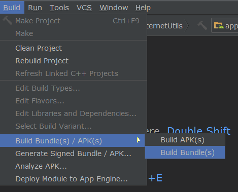
---
## Requisitos
+++
### Androi Studio 3.2
+++
### App Signing
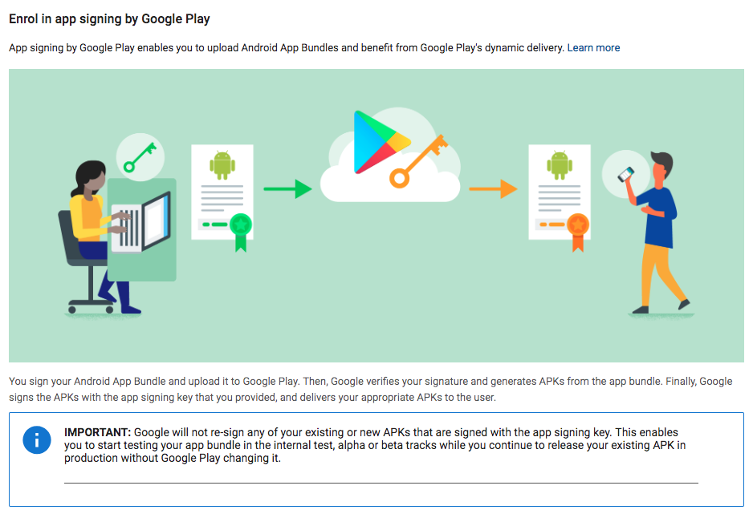
---
### Cómo funciona?
+++
### Bundletool
###### https://developer.android.com/studio/command-line/bundletool
+++
### .aab

##### https://developer.android.com/guide/app-bundle/+++
Note:

- abb no se puede instalar
- no es lo mismo que un apk
+++
#### Google play firma nuestras apps
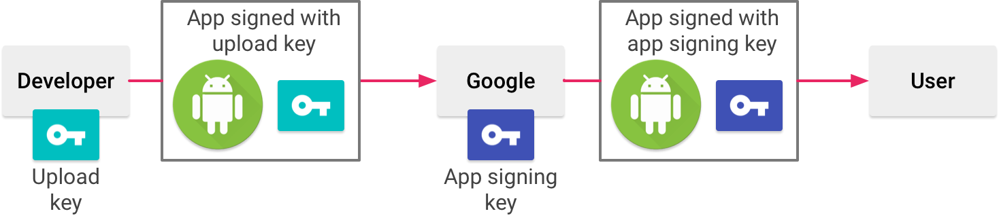
+++
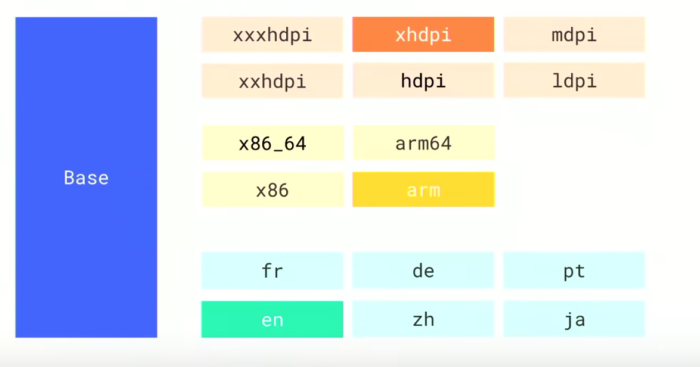
+++
### Reducir tamaño app
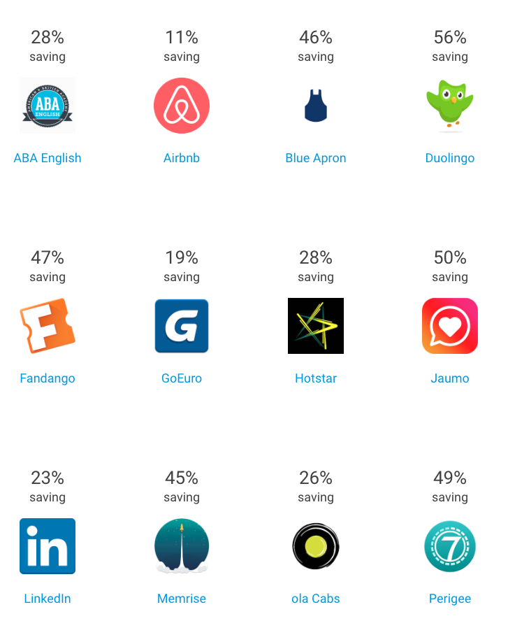
---
### Configuraciones
+++
```groovy
bundle {
    density{
        enableSplit = false
    }
    
    abi {
        enableSplit = false
    }
    
    language {
        enableSplit = false
    }
}
```
---
### Ejemplo real
+++
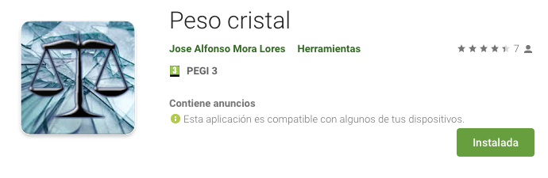
###### https://play.google.com/store/apps/details?id=com.josealfonsomora.pesoscristal
+++
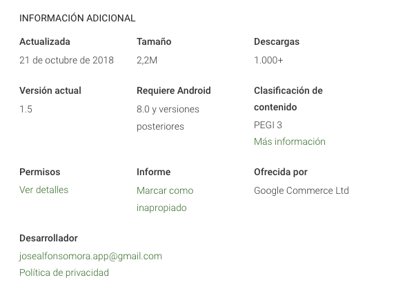
+++
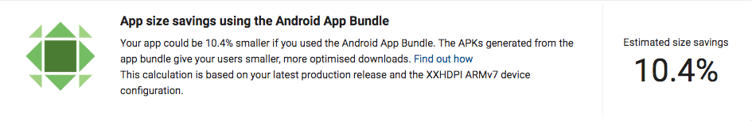
+++
### Bundle Explorer en Google Play Console
+++
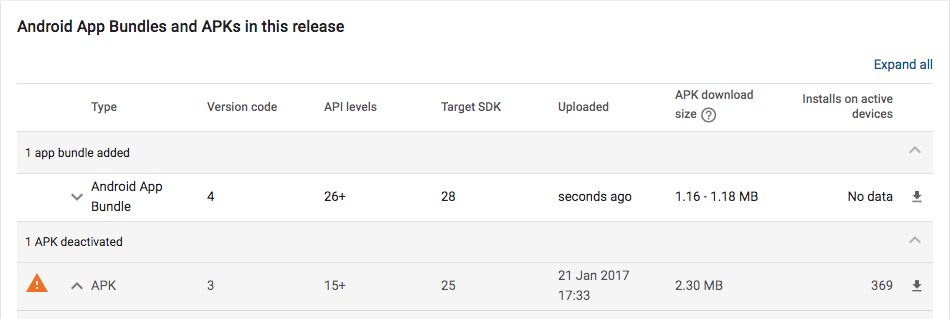
---
### Otro ejemplo
+++
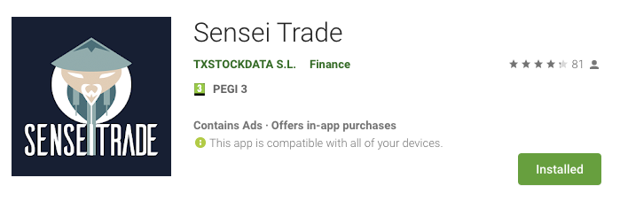
###### https://play.google.com/store/apps/details?id=com.txstockdata.senseitrade1
+++
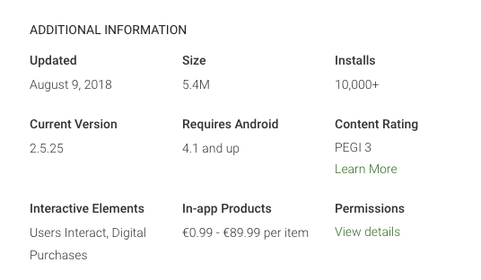
---
